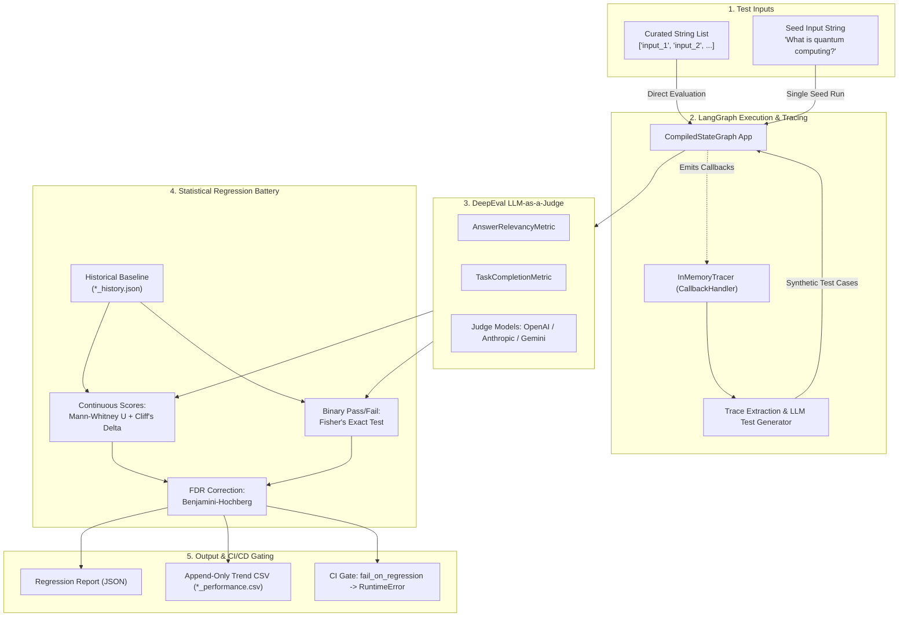

# LangGraph Evaluator

<p align="center">
  <strong>Statistical Evaluation, Distributional Regression Testing, and CI/CD Quality Gating for LangGraph Applications</strong>
</p>

<p align="center">
  <a href="https://python.org"></a>
  <a href="https://github.com/langchain-ai/langgraph"></a>
  <a href="https://github.com/confident-ai/deepeval"></a>
  <a href="https://scipy.org"></a>
  <a href="https://docs.pytest.org"></a>
  <a href="https://semver.org"></a>
  <a href="https://opensource.org/licenses/MIT"></a>
</p>

---

## Table of Contents

- [Overview](#overview)
- [Why LangGraph Evaluator?](#why-langgraph-evaluator)
  - [The Flaw of Scalar Thresholds](#the-flaw-of-scalar-thresholds)
  - [The Distributional Statistical Solution](#the-distributional-statistical-solution)
- [Core Architecture](#core-architecture)
- [Statistical and Mathematical Foundation](#statistical-and-mathematical-foundation)
  - [1. Mann-Whitney U Test (Continuous Score Shift)](#1-mann-whitney-u-test-continuous-score-shift)
  - [2. Cliff's Delta Effect Size (Magnitude Gating)](#2-cliffs-delta-effect-size-magnitude-gating)
  - [3. Fisher's Exact Test (Binary Success Rates)](#3-fishers-exact-test-binary-success-rates)
  - [4. Benjamini-Hochberg FDR Correction (Multi-Testing Safety)](#4-benjamini-hochberg-fdr-correction-multi-testing-safety)
- [When to Use LangGraph Evaluator](#when-to-use-langgraph-evaluator)
- [Installation and Prerequisites](#installation-and-prerequisites)
- [LLM Provider Configuration](#llm-provider-configuration)
- [Quick Start Guide](#quick-start-guide)
  - [Scenario A: Evaluation with a Curated Test Suite](#scenario-a-evaluation-with-a-curated-test-suite)
  - [Scenario B: Zero-Config Seed Evaluation via Synthetic Test Generation](#scenario-b-zero-config-seed-evaluation-via-synthetic-test-generation)
  - [Scenario C: Enforcing Strict CI/CD Failure Gates](#scenario-c-enforcing-strict-cicd-failure-gates)
- [Pytest Integration and Automated NodeID Resolution](#pytest-integration-and-automated-nodeid-resolution)
- [Storage Architecture and Data Artifacts](#storage-architecture-and-data-artifacts)
  - [Historical JSON Runs (`*_history.json`)](#historical-json-runs-_historyjson)
  - [Human-Readable Trend CSV (`*_performance.csv`)](#human-readable-trend-csv-_performancecsv)
- [API Reference](#api-reference)
  - [`langgraph_evaluator.test(...)`](#langgraph_evaluatortest)
  - [Statistical Battery: `stats` Module](#statistical-battery-stats-module)
- [CI/CD Pipeline Example (GitHub Actions)](#cicd-pipeline-example-github-actions)
- [Contributing](#contributing)
- [License](#license)

---

## Overview

**`langgraph-evaluator`** is a statistical evaluation and regression testing framework purpose-built for [LangGraph](https://github.com/langchain-ai/langgraph) applications and multi-agent state machines.

Moving LLM agent workflows into production requires continuous validation. However, traditional LLM evaluation approaches suffer from stochastic noise, flakiness, arbitrary pass/fail cutoffs, and multiple-testing errors. `langgraph-evaluator` replaces arbitrary heuristic checks with **non-parametric statistical hypothesis testing, Romano et al. effect size gating, and Benjamini-Hochberg False Discovery Rate (FDR) control**.

Whether you are modifying prompts, switching frontier models, restructuring graph state schemas, or refactoring agent tools, `langgraph-evaluator` guarantees that you catch genuine regressions without being inundated by false-alarm test failures.

---

## Why LangGraph Evaluator?

### The Flaw of Scalar Thresholds

Most teams evaluate agents by averaging metrics over a test set:

```python
# Traditional Brittle Evaluation
avg_score = sum(scores) / len(scores)
assert avg_score >= 0.85  # Fragile!
```

This approach has fatal weaknesses:

1. **Stochastic LLM Variance**: An identical prompt evaluated on GPT-4.1, Claude Sonnet, or Gemini Flash might score $0.86$ in run A and $0.83$ in run B due to pure sampling variance, triggering spurious pipeline failures.
2. **Sensitivity to Outliers vs. Masked Drops**: A single outlier can artificially skew the mean, masking an actual systemic degradation across the 90th percentile of user queries.
3. **Multi-Testing False Alarms**: When testing 10 metrics across 5 agent branches ($10 \times 5 = 50$ tests), setting $\alpha = 0.05$ creates a **92.3% probability** of at least one false alarm regression ($1 - (1 - 0.05)^{50} \approx 0.923$).
4. **Lack of Effect Size**: A statistically significant p-value on a large dataset may correspond to an imperceptible score drop of $0.002$, halting releases unnecessarily.

### The Distributional Statistical Solution

`langgraph-evaluator` stores **full probability distributions** of every test run and conducts formal two-sample non-parametric hypothesis testing against the preceding baseline:

| Problem | Traditional Evaluation | `langgraph-evaluator` Solution |
| :--- | :--- | :--- |
| **Score Noise** | Arbitrary threshold (`score > 0.8`) | **Mann-Whitney U Test** comparing distributions non-parametrically |
| **Micro-Drops** | Halts CI on trivial score dips | **Cliff's Delta Effect Size** ($|\delta| \ge 0.147$) requires non-negligible drop |
| **Success Rates** | Naive percentage subtraction | **Fisher's Exact Test** on $2 \times 2$ contingency table |
| **Test Multiplicity** | Accumulated false-alarm rate | **Benjamini-Hochberg (FDR)** multi-testing p-value correction |
| **Test Creation** | Manual question writing | **`InMemoryTracer` + Synthetic LLM Test Generation** from execution traces |
| **CI Gating** | Custom scripts | Native **Pytest NodeID Resolution** + `fail_on_regression` flag |

---

## Core Architecture



---

## Statistical and Mathematical Foundation

`langgraph-evaluator` operates on rigorous non-parametric statistical principles designed for bounded, non-Gaussian LLM metrics.

### 1. Mann-Whitney U Test (Continuous Score Shift)

For continuous metrics (e.g. relevancy score $\in [0, 1]$), data is rarely normally distributed. The Mann-Whitney U test (Wilcoxon rank-sum test) tests the null hypothesis that a randomly selected value from the candidate run $X_{\text{after}}$ is equal to a randomly selected value from baseline $X_{\text{before}}$.

$$\mathbf{H_0}: P(X_{\text{after}} < X_{\text{before}}) = P(X_{\text{before}} < X_{\text{after}})$$
$$\mathbf{H_1}: P(X_{\text{after}} < X_{\text{before}}) > P(X_{\text{before}} < X_{\text{after}}) \quad (\text{one-sided drop})$$

All observations from both groups are pooled and ranked:

$$U_{\text{after}} = R_{\text{after}} - \frac{n_{\text{after}}(n_{\text{after}} + 1)}{2}$$

Where $R_{\text{after}}$ is the sum of ranks assigned to the candidate group.

### 2. Cliff's Delta Effect Size (Magnitude Gating)

A statistically significant p-value ($p < 0.05$) can occur even for negligible score differences when sample sizes are moderate. To ensure that only **practically meaningful degradations** trigger pipeline warnings or build breaks, the framework computes **Cliff's Delta ($\delta$)**:

$$\delta = \frac{\sum_{i=1}^{n_{\text{after}}} \sum_{j=1}^{n_{\text{before}}} \operatorname{sign}(x_i - x_j)}{n_{\text{after}} \cdot n_{\text{before}}}$$

Where:
$$\operatorname{sign}(x_i - x_j) = \begin{cases} +1, & x_i > x_j \\ -1, & x_i < x_j \\ 0, & x_i = x_j \end{cases}$$

Effect sizes are interpreted using standard **Romano et al. (2006)** thresholds:
- $|\delta| < 0.147 \implies$ **Negligible** *(ignored by regression gate)*
- $0.147 \le |\delta| < 0.330 \implies$ **Small**
- $0.330 \le |\delta| < 0.474 \implies$ **Medium**
- $|\delta| \ge 0.474 \implies$ **Large**

> **Regression Rule (Continuous)**: A metric is flagged as a regression **if and only if** $P_{\text{adjusted}} < \alpha$ **AND** $\delta \le -0.147$.

### 3. Fisher's Exact Test (Binary Success Rates)

For binary pass/fail criteria (e.g., whether `TaskCompletionMetric.success == True`), outcomes are tabulated into a $2 \times 2$ contingency table:

| Group | Pass (Success) | Fail | Total |
| :--- | :---: | :---: | :---: |
| **After (Candidate)** | $a$ | $b$ | $a + b = n_{\text{after}}$ |
| **Before (Baseline)** | $c$ | $d$ | $c + d = n_{\text{before}}$ |
| **Total** | $k$ | $n - k$ | $N$ |

Under the null hypothesis of equal pass rates, the probability of obtaining the observed table follows the hypergeometric distribution:

$$P = \frac{\binom{a + b}{a} \binom{c + d}{c}}{\binom{N}{a + c}} = \frac{(a+b)!\,(c+d)!\,(a+c)!\,(b+d)!}{a!\,b!\,c!\,d!\,N!}$$

A one-sided test (`alternative="less"`) computes the exact probability of observing a pass rate as low as, or lower than, that observed in the candidate run.

> **Regression Rule (Binary)**: A binary check is flagged as a regression **if and only if** $P_{\text{adjusted}} < \alpha$ **AND** $\text{PassRate}_{\text{after}} < \text{PassRate}_{\text{before}}$.

### 4. Benjamini-Hochberg FDR Correction (Multi-Testing Safety)

When evaluating $m$ different metrics (e.g., relevancy continuous, completion continuous, relevancy binary, completion binary), testing each at $\alpha = 0.05$ inflates the overall False Positive rate.

The **Benjamini-Hochberg (BH)** procedure controls the False Discovery Rate (FDR) at level $\alpha$:
1. Sort raw p-values in ascending order: $P_{(1)} \le P_{(2)} \le \dots \le P_{(m)}$.
2. Compute adjusted p-values:
   $$Q_{(k)} = \min\left(1.0, \, P_{(k)} \cdot \frac{m}{k}\right)$$
3. Enforce monotonicity backwards from $k = m - 1$ down to $1$:
   $$P^{\text{adj}}_{(k)} = \min\left(Q_{(k)}, \, P^{\text{adj}}_{(k+1)}\right)$$

---

## When to Use LangGraph Evaluator

| Scenario | Challenge | How LangGraph Evaluator Helps |
| :--- | :--- | :--- |
| **CI/CD Pull Request Validation** | PRs modifying agent prompts or nodes can silently degrade output quality without failing traditional unit tests. | Add `fail_on_regression=True` to your pytest suite. CI automatically blocks PRs that cause statistically confirmed quality drops. |
| **LLM Model Upgrades and Swaps** | Upgrading from `gpt-4o` to `gpt-4.1` or switching to `claude-sonnet-4-6` or `gemini-3.1-flash-lite`. | Run the regression battery to statistically verify that the new model maintains or improves relevancy and completion scores across your dataset. |
| **Prompt Engineering and Iteration** | Changing system prompts or tool instructions often fixes one edge case while degrading three others. | Full history tracking (`*_history.json`) gives side-by-side delta comparisons and effect size shifts for every prompt variation. |
| **Agent Topology and Graph Refactoring** | Adding subgraphs, human-in-the-loop interruptions, router nodes, or memory checkpointers. | Ensures the end-to-end user-facing output preserves relevancy and task completion regardless of internal architectural changes. |
| **Cold-Start Evaluation (No Golden Dataset)** | You just built a LangGraph app and don't have a labeled dataset of 50 test inputs. | Provide a single representative seed string; `InMemoryTracer` records the execution graph and synthesizes a full test battery automatically. |

---

## Installation and Prerequisites

`langgraph-evaluator` requires **Python 3.14+** and modern packaging tools such as [`uv`](https://github.com/astral-sh/uv) or standard `pip`.

### Using `uv` (Recommended)

```bash
uv add langgraph-evaluator
```

### Using standard `pip`

```bash
pip install langgraph-evaluator
```

### Development Installation

```bash
git clone https://github.com/divu050704/langgraph-evaluator.git
cd langgraph-evaluator
uv sync --all-groups
```

To run the internal verification suite:

```bash
pytest tests/test_regression.py -v
```

---

## LLM Provider Configuration

The evaluation framework leverages **DeepEval** with automatic judge-model discovery. Set one (or more) of the following environment variables in your environment or `.env` file:

```bash
# OpenAI (Default model: gpt-4.1)
export OPENAI_API_KEY="sk-..."

# Anthropic (Default model: claude-sonnet-4-6)
export ANTHROPIC_API_KEY="sk-ant-..."

# Google Gemini (Default model: gemini-3.1-flash-lite)
export GOOGLE_API_KEY="AIzaSy..."
```

### Auto-Detection Hierarchy

When neither `provider` nor `model_name` is explicitly passed:
1. `OPENAI_API_KEY` is checked -> Uses `GPTModel(model="gpt-4.1")`
2. `ANTHROPIC_API_KEY` is checked -> Uses `AnthropicModel(model="claude-sonnet-4-6")`
3. `GOOGLE_API_KEY` is checked -> Uses `GeminiModel(model="gemini-3.1-flash-lite")`

You can override both at runtime via the `provider` and `model_name` parameters.

---

## Quick Start Guide

### Scenario A: Evaluation with a Curated Test Suite

Pass a list of query inputs directly to evaluate an existing compiled LangGraph application.

```python
from typing import TypedDict
from langgraph.graph import StateGraph, START, END
import langgraph_evaluator

# 1. Define your LangGraph State and Agent
class AgentState(TypedDict):
    question: str
    answer: str

def responder(state: AgentState):
    # Simulated agent logic
    return {"answer": f"Accurate technical response to: {state['question']}"}

workflow = StateGraph(AgentState)
workflow.add_node("responder", responder)
workflow.add_edge(START, "responder")
workflow.add_edge("responder", END)
app = workflow.compile(name="tech_support_agent")

# 2. Run the evaluation battery
test_queries = [
    "How do I configure OAuth2 with PKCE?",
    "Explain how database connection pooling works in PostgreSQL.",
    "What is the difference between TCP and UDP?",
    "How does caching prevent cache stampedes?",
    "Describe ACID guarantees in relational databases."
]

result = langgraph_evaluator.test(
    app=app,
    inputs=test_queries,
    input_parameter="question",
    output_parameter="answer",
    provider="openai",               # or "anthropic", "gemini"
    save_results=True,               # Stores historical baseline
    alpha=0.05
)

print(f"Target ID: {result['target_id']}")
print(f"Current Relevancy Avg: {result['current']['relevancy_metrics_avg_score']}")
print(f"Current Completion Avg: {result['current']['completion_metrics_avg_score']}")

if result.get("regression_report"):
    print(f"Regression Detected: {result['regression_report']['has_regression']}")
```

---

### Scenario B: Zero-Config Seed Evaluation via Synthetic Test Generation

If you only have one seed prompt, pass a single `str`. `langgraph-evaluator` will:
1. Attach an `InMemoryTracer` callback to the graph invocation.
2. Capture node execution hierarchy, inputs, outputs, and intermediate states.
3. Feed the structured trace to the LLM judge to synthesize realistic edge cases and test inputs.
4. Execute the full test battery on the generated inputs.

```python
import langgraph_evaluator

# Passing a single seed string activates the trace tracer + synthetic test generator
result = langgraph_evaluator.test(
    app=app,
    inputs="My order #12344 has not arrived yet and tracking is stuck.",
    input_parameter="user_query",
    output_parameter="agent_response",
    graph_name="customer_support_flow"
)

print("Generated and evaluated test battery!")
print(f"Raw metrics collected: {len(result['raw_current_metrics']['relevancy_metrics'])} cases")
```

---

### Scenario C: Enforcing Strict CI/CD Failure Gates

To use `langgraph-evaluator` as a blocking gate in your build pipeline, set `fail_on_regression=True`.

```python
import pytest
import langgraph_evaluator

def test_support_bot_regression_gate(support_bot_app):
    """
    This test runs the evaluation battery and raises a RuntimeError
    if statistically significant performance degradation is detected.
    """
    langgraph_evaluator.test(
        app=support_bot_app,
        inputs=[
            "How do I reset my API token?",
            "Where can I download tax invoice receipts?",
            "How do I invite teammates to my enterprise organization?",
            "What happens if my webhook endpoint is unreachable?",
            "Can I downgrade my subscription mid-billing-cycle?"
        ],
        input_parameter="query",
        output_parameter="response",
        fail_on_regression=True,  # Raises RuntimeError on confirmed regression
        alpha=0.05
    )
```

If a regression is detected, the run aborts with a clear statistical explanation:

```text
RuntimeError: Statistical performance regression detected in CI run:
- relevancy_metrics_continuous: Significant continuous score drop (p_adj=0.0034 < 0.05, Cliff's delta=-0.62 <= -0.147)
- completion_metrics_binary: Significant pass rate drop (p_adj=0.012 < 0.05, 0.95 -> 0.60)
```

---

## Pytest Integration and Automated NodeID Resolution

When running inside `pytest`, test targets are automatically resolved without any manual naming required.

The resolver inspects:
1. **Explicit parameter**: `graph_name="custom_name"` (Highest priority).
2. **Graph attribute**: `app.name` (if defined and not default `"LangGraph"`).
3. **Pytest environment**: `PYTEST_CURRENT_TEST` environment variable.
   - Example: `tests/integration/test_agent.py::test_rag_pipeline (call)`
   - Formatted to: `tests_integration_test_agent__test_rag_pipeline`
4. **Call stack inspection**: Caller filename + caller function name.
5. **Fallback**: `"graph"`.

### Example Pytest Suite

```python
# File: tests/test_agent_quality.py
import pytest
from my_project.agent import build_agent
from langgraph_evaluator import test

@pytest.fixture(scope="module")
def agent():
    return build_agent()

def test_general_qa(agent):
    test(
        app=agent,
        inputs=["What is idempotency?", "Define distributed consensus."],
        input_parameter="prompt",
        output_parameter="reply",
        fail_on_regression=True
    )
```

Run directly:

```bash
pytest tests/test_agent_quality.py -v
```

---

## Storage Architecture and Data Artifacts

Results are saved to `test_results/` (or a custom directory specified via `results_dir`).

```text
test_results/
├── tests_test_agent_quality__test_general_qa_history.json
└── tests_test_agent_quality__test_general_qa_performance.csv
```

### Historical JSON Runs (`*_history.json`)

Preserves the complete probability distribution across runs:

```json
[
  {
    "target_id": "tests_test_agent_quality__test_general_qa",
    "timestamp": "2026-09-28T10:15:30",
    "summary": {
      "timestamp": "2026-09-28T10:15:30",
      "relevancy_metrics_avg_score": 0.935,
      "relevancy_metrics_success_rate": 1.0,
      "completion_metrics_avg_score": 0.912,
      "completion_metrics_success_rate": 1.0
    },
    "metrics": {
      "relevancy_metrics": [
        {"score": 0.95, "success": true, "reason": "Accurate response"},
        {"score": 0.92, "success": true, "reason": "Direct answer"}
      ],
      "completion_metrics": [
        {"score": 0.90, "success": true, "reason": "Completed goal"},
        {"score": 0.924, "success": true, "reason": "Fully resolved"}
      ]
    },
    "regression_detected": false
  }
]
```

### Human-Readable Trend CSV (`*_performance.csv`)

Appended on each test execution for quick visual analysis or dashboard plotting:

| timestamp | relevancy_metrics_avg_score | relevancy_metrics_success_rate | completion_metrics_avg_score | completion_metrics_success_rate | regression_detected |
| :--- | :--- | :--- | :--- | :--- | :--- |
| 2026-09-28T10:15:30 | 0.935 | 1.0 | 0.912 | 1.0 | False |
| 2026-09-28T11:42:15 | 0.941 | 1.0 | 0.925 | 1.0 | False |
| 2026-09-28T14:10:02 | 0.612 | 0.5 | 0.580 | 0.4 | True |

---

## API Reference

### `langgraph_evaluator.test(...)`

```python
def test(
    app: CompiledStateGraph,
    inputs: Union[List[str], str],
    output_parameter: str,
    input_parameter: str,
    provider: Optional[str] = None,
    model_name: Optional[str] = None,
    graph_name: Optional[str] = None,
    save_results: bool = True,
    alpha: float = 0.05,
    fail_on_regression: bool = False,
    results_dir: Union[Path, str] = "test_results",
) -> Union[EvaluationResult, test_type]:
```

#### Parameters

- `app` (*CompiledStateGraph*): The compiled LangGraph application instance.
- `inputs` (*List[str] | str*): List of test inputs, or a single seed input string to trigger trace-based test generation.
- `output_parameter` (*str*): The key in the LangGraph state containing the final agent output.
- `input_parameter` (*str*): The key in the LangGraph state that receives the input query.
- `provider` (*Optional[str]*): Explicit LLM provider (`"openai"`, `"anthropic"`, `"gemini"`). Auto-detected if `None`.
- `model_name` (*Optional[str]*): Explicit model name override (e.g., `"gpt-4.1"`, `"claude-sonnet-4-6"`, `"gemini-3.1-flash-lite"`).
- `graph_name` (*Optional[str]*): Custom identifier override for storing results.
- `save_results` (*bool*): If `True`, persists history and runs statistical regression battery. Default `True`.
- `alpha` (*float*): Significance threshold for FDR-adjusted p-values. Default `0.05`.
- `fail_on_regression` (*bool*): If `True`, raises `RuntimeError` when a regression is statistically confirmed. Default `False`.
- `results_dir` (*Path | str*): Directory where history JSON and CSV files are stored. Default `"test_results"`.

#### Return Type: `EvaluationResult`

```python
{
    "target_id": str,
    "current": Dict[str, Any],              # Scalar summary of current run
    "previous": Optional[Dict[str, Any]],   # Scalar summary of baseline run
    "diff": Optional[Dict[str, Any]],       # Scalar differences (current - previous)
    "regression_report": {
        "has_regression": bool,
        "alpha": float,
        "total_tests_conducted": int,
        "results": {
            "<metric>_<continuous|binary>": {
                "metric": str,
                "type": "continuous" | "binary",
                "test": str,
                "effect_size": float,
                "effect_size_magnitude": str,
                "raw_p_value": float,
                "adjusted_p_value": float,
                "is_regression": bool,
                "reason": str
            }
        }
    },
    "raw_current_metrics": test_type,
    "history_file": str,
    "csv_file": str
}
```

---

### Statistical Battery: `stats` Module

You can also use the statistical routines independently:

```python
from langgraph_evaluator import (
    cliffs_delta,
    mann_whitney_u_test,
    fishers_exact_test,
    benjamini_hochberg,
    evaluate_regression_battery
)

# Cliff's Delta effect size
delta, magnitude = cliffs_delta(after=[0.4, 0.45, 0.5], before=[0.9, 0.95, 0.92])
# delta = -1.0, magnitude = "large"

# Mann-Whitney U one-sided drop test
p_val = mann_whitney_u_test(after=[0.4, 0.45, 0.5], before=[0.9, 0.95, 0.92])

# Fisher's Exact Test on binary outcomes
p_val, after_rate, before_rate = fishers_exact_test(
    after_successes=[False, False, True],
    before_successes=[True, True, True]
)

# Benjamini-Hochberg FDR correction
adj_p_values = benjamini_hochberg([0.001, 0.02, 0.04, 0.25])
```

---

## CI/CD Pipeline Example (GitHub Actions)

Add this workflow to `.github/workflows/eval.yml` to automatically gate pull requests:

```yaml
name: Agent Evaluation & Regression Gate

on:
  pull_request:
    branches: [main]
  push:
    branches: [main]

jobs:
  evaluate:
    runs-on: ubuntu-latest

    steps:
      - name: Checkout Code
        uses: actions/checkout@v4

      - name: Set up Python
        uses: actions/setup-python@v5
        with:
          python-version: "3.14"

      - name: Install uv
        uses: astral-sh/setup-uv@v3
        with:
          version: "latest"

      - name: Install Dependencies
        run: uv sync --all-groups

      - name: Restore Historical Evaluation Results
        uses: actions/cache@v4
        with:
          path: test_results/
          key: eval-history-${{ runner.os }}-${{ github.ref_name }}
          restore-keys: |
            eval-history-${{ runner.os }}-main
            eval-history-${{ runner.os }}-

      - name: Run Regression Battery
        env:
          OPENAI_API_KEY: ${{ secrets.OPENAI_API_KEY }}
          ANTHROPIC_API_KEY: ${{ secrets.ANTHROPIC_API_KEY }}
          GOOGLE_API_KEY: ${{ secrets.GOOGLE_API_KEY }}
        run: uv run pytest tests/test_agent_quality.py -v

      - name: Save Updated Evaluation History
        if: github.ref == 'refs/heads/main'
        uses: actions/cache/save@v4
        with:
          path: test_results/
          key: eval-history-${{ runner.os }}-${{ github.sha }}
```

---

## Contributing

Contributions are welcome! Please follow these guidelines:

1. **Fork the repository** and create a feature branch (`git checkout -b feat/statistical-enhancement`).
2. **Implement your changes** with rigorous tests in `tests/`.
3. **Verify the entire test suite**:
   ```bash
   pytest tests/test_regression.py -v
   ```
4. **Submit a Pull Request** describing your rationale, mathematical formulas, and sample benchmark data.

---

## License

This project is licensed under the **MIT License**. See the [LICENSE](LICENSE) file for details.
